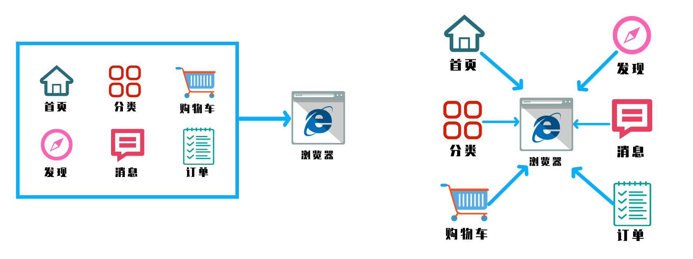

# 微前端

相信大家近一两年对微前端都有所耳闻， 感觉听上去非常的高大上！但是实际上微前端还是比较简单的，也相对容易落地。那么什么是微前端呢？


## 什么是微前端？



微前端是一种类似于微服务的架构，它将微服务的理念应用于浏览器端，即将 Web 应用由单一的单体应用转变为多个小型前端应用聚合为一的应用。——《前端架构从入门到微前端》 黄峰达

Techniques, strategies and recipes for building a modern web app with multiple teams that can ship features independently. ——[Micro Frontends 官网](https://micro-frontends.org/)

可以由多个团队独立开发的现代web应用程序的技术、策略和方案。

微前端就是将不同的功能按照不同的维度拆分成多个子应用。通过主应用来加载这些子应用。

微前端的核心在于**拆**和拆完后再**合**！


## 微前端的价值

### 微前端架构具备以下几个核心价值：

- **技术栈无关**
  主框架不限制接入应用的技术栈，微应用具备完全自主权

- 独立开发、独立部署
  微应用仓库独立，前后端可独立开发，部署完成后主框架自动完成同步更新

- 增量升级

  在面对各种复杂场景时，我们通常很难对一个已经存在的系统做全量的技术栈升级或重构，而微前端是一种非常好的实施渐进式重构的手段和策略

- 独立运行
  每个微应用之间状态隔离，运行时状态不共享

我各人认为微前端的核心价值在于 **技术栈无关**，这才是它能够诞生的原因，或者说这才是微前端最吸引我的地方。

当然微前端的前提，还是得有主体应用，然后才有微组件或微应用（widget），解决的是可控体系下的前端协同开发问题（含空间分离带来的协作和时间延续带来的升级维护）

「空间分离带来的协作问题」是在一个规模可观的应用的场景下会明显出现的问题，而「时间延续带来的升级维护」几乎是所有年龄超过 3 年的 web 应用都会存在的问题。


## 实现微前端的几种方式

### 为什么不是iframe？

说到这里，肯定会有人说，这些功能Iframe也可以实现这些功能。没错iframe确实可以，但是为什么不是Iframe？因为iframe存在很多体验上的问题


### 几种方案的对比

| 方案               | 描述                                                         | 优点                                               | 缺点                                                         |
| ------------------ | ------------------------------------------------------------ | -------------------------------------------------- | ------------------------------------------------------------ |
| Nginx路由转发      | 通过Nginx配置反向代理来实现不同路径映射到不同应用，例如：www.abc.com/app1对应app1，www.abc.com/app2对应app2，本身并不属于前端层面的改造，更多的是运维的配置 | 简单，快速，易配置                                 | 在切换应用时会触发浏览器刷新，影响体验                       |
| iframe嵌套         | 父应用单独是一个页面，每个子应用嵌套一个iframe，父子通信可以通过postMessage或者contentWindow方式 | 实现简单，子应用之间自带沙箱，天然隔离，互不干扰   | iframe的样式显示、兼容性等都具有局限性                       |
| npm包形式          | 子工程已NPM包的形式发布源码，打包构建发布还是由基座工程管理，打包时集成 |                                                    | 打包部署慢，不能单独部署                                     |
| Web Components     | 每个子应用需要采用纯Web Components技术编写组件，是一套全新的开发模式 | 每个子应用拥有独立的script和css，也可以单独部署    | 对于历史系统改造成本高，子应用通信较为复杂                   |
| 组合式应用路由分发 | 每个子应用独立构建和部署，运行时由父应用进行路由管理，应用加载，启动，卸载，以及通信机制 | 纯前端改造，体验良好，可无感知切换，子应用相互隔离 | 需要设计和开发，由于父子应用处于同一页面运行，需要解决子应用的样式冲突，变量对象污染，通信机制等技术点 |
| 特定中心路由基座式 | 子业务线之间使用相同技术栈，基座工程和子工程可以单独开发单独部署；子工程有能力复用基座公共基建 | 通信方式多，单独部署                               | 限定技术栈                                                   |


## 微前端如何落地

### 微前端的路由劫持（路由分发）


由于我们的子应用都是 lazy load 的，当浏览器重新刷新时，主框架的资源会被重新加载，同时异步 load 子应用的静态资源，由于此时主应用的路由系统已经激活，但子应用的资源可能还没有完全加载完毕，从而导致路由注册表里发现没有能匹配子应用 `/subApp/123/detail` 的规则，这时候就会导致跳 NotFound 页或者直接路由报错。

解决的思路也很简单，我们需要设计这样一套路由机制：

主框架配置子应用的路由为 `subApp: { url: '/subApp/**', entry: './subApp.js' }`，则当浏览器的地址为 `/subApp/abc` 时，框架需要先加载 entry 资源，待 entry 资源加载完毕，确保子应用的路由系统注册进主框架之后后，再去由子应用的路由系统接管 url change 事件。同时在子应用路由切出时，主框架需要触发相应的 destroy 事件，子应用在监听到该事件时，调用自己的卸载方法卸载应用，如 React 场景下 `destroy = () => ReactDOM.unmountAtNode(container)`。

### 微前端的应用隔离

应用隔离问题主要分为主应用和微应用，微应用和微应用之间的JavaScript执行环境隔离，CSS样式隔离，我们先来说下CSS的隔离。

#### `CSS`隔离方案

##### **子应用之间样式隔离**：

- `Dynamic Stylesheet`动态样式表，当应用切换时移除老应用样式，添加新应用样式

##### **主应用和子应用之间的样式隔离**：

- `BEM`(Block Element Modifier) 约定项目前缀，开发人员自己约定class的类名
- `CSS-Modules` 打包时生成不冲突的选择器名
- `Shadow DOM` 真正意义上的隔离。比如video标签，里面有暂停，播放等按钮
- `css-in-js` [CSS in JS的好与坏](https://zhuanlan.zhihu.com/p/103522819)

`qiankun2.0`中采用的是`Shadow DOM`这种方式

```js
let shadowDom = shadow.attachShadow({ mode: 'open' });
let pElement = document.createElement('p');
pElement.innerHTML = 'hello world';
let styleElement = document.createElement('style');
styleElement.textContent = `
    p{color:red}
`
shadowDom.appendChild(pElement);
shadowDom.appendChild(styleElement)
```


#### `JS`沙箱机制

##### 快照沙箱

- 1.激活时将当前window属性进行快照处理
- 2.失活时用快照中的内容和当前window属性比对
- 3.如果属性发生变化保存到`modifyPropsMap`中，并用快照还原window属性
- 4.再次激活时，再次进行快照，并用上次修改的结果还原window

```js
 class SnapshotSandbox {
     constructor() {
         this.proxy = window
         this.modifyPropsMap = {} // 修改了那些属性
         this.active()
     }

     active() {
         this.windowSnapshot = {} // window对象的快照
         for (const prop in window) {
             if (window.hasOwnProperty(prop)) {
                 // 将window上的属性进行拍照
                 this.windowSnapshot[prop] = window[prop]
             }
         }
         Object.keys(this.modifyPropsMap).forEach((p) => {
             window[p] = this.modifyPropsMap[p]
         })
     }
 }

let sandbox = new SnapshotSandbox()
;((window) => {
    window.a = 1
    window.b = 2
    console.log(window.a, window.b)
})(sandbox.proxy)
```

但是这有一个显而易见的问题，如果是多应用的话，就没办法是实现了，这就可以使用ES6的Proxy


##### Proxy 代理沙箱

在多应用的场景下，可以不相互影响的使用同一个变量名

```js
class ProxySandbox {
    constructor() {
        const rawWindow = window
        const fakeWindow = {}
        const proxy = new Proxy(fakeWindow, {
            set(target, p, value) {
                target[p] = value
                return true
            },
            get(target, p) {
                return target[p] || rawWindow[p]
            },
        })
        this.proxy = proxy
    }
}

let sandbox1 = new ProxySandbox()
let sandbox2 = new ProxySandbox()

window.a = 1

;((window) => {
    window.a = 'hello'
    console.log(window.a)
    
    
})(sandbox1.proxy)

;((window) => {
    window.a = 'world'
    console.log(window.a)
})(sandbox2.proxy)

console.log(window.a) // 1
```


###### 借用了`iframe` 的 `contentWindow`

基于`iframe`方案实现上比较取巧，利用浏览器`iframe`环境隔离的特性。`iframe`标签可以创造一个独立的浏览器原生级别的运行环境，这个环境被浏览器实现了与主环境的隔离。同时浏览器提供了`postmessage`等方式让主环境与`iframe`环境可以实现通信，这就让基于`iframe`的沙箱环境成为可能。

> 注意：只有同域的 `iframe` 才能取出对应的的 `contentWindow`. 所以需要提供一个宿主应用空的同域URL来作为这个` iframe` 初始加载的 URL. 根据 HTML 的规范 这个 URL 用了 `about:blank` 一定保证保证同域，也不会发生资源加载。

借用了 `iframe` 的 `contentWindow`，去得到一个完全不同的 window

```js
class SandboxWindow {
    constructor(options, context, frameWindow) {
        return new Proxy(frameWindow, {
            set(target, name, value) {
                if (Object.keys(context).includes(name)) {
                    context[name] = value
                }
                target[name] = value
            },
            get(target, name) {
                // 优先使用共享对象
                if (Object.keys(context).includes(name)) {
                    return context[name]
                }
                if (typeof target[name] === 'function' && /^[a-z]/.test(name)) {
                    return target[name].bind && target[name].bind(target)
                } else {
                    return target[name]
                }
            },
        })
    }
}

const iframe = document.createElement('iframe', { url: 'about:blank' })
document.body.appendChild(iframe)
const sandboxGlobal = iframe.contentWindow
// 需要全局共享的变量
const context = { document: window.document, history: window.history }
const newSandBoxWindow = new SandboxWindow({}, context, sandboxGlobal)

const codeStr = 'var test = 1;'
const run = (code) => {
    window.eval(`
;(function(global, self){with(global){;${code}}}).bind(newSandBoxWindow)(newSandBoxWindow, newSandBoxWindow);
`)
}

run(codeStr)
console.log(newSandBoxWindow.window.test) // 1
console.log(window.test) // undefined
// 操作沙箱环境下的全局变量
newSandBoxWindow.history.pushState(null, null, '/index')
newSandBoxWindow.location.hash = 'about'
```


### 微前端应用间通信

- 基于URL来进行数据传递，但是传递消息能力弱
- 基于`CustomEvent`实现通信
- 基于props主子应用间通信
- 使用全局变量、`Redux`进行通信


## 微前端的主流方案

- [Ara Framework](https://ara-framework.github.io/website/) ：由服务端渲染延伸出的微前端框架。
- [Mooa](http://mooa.phodal.com/) ：基于Angular的微前端服务框架，这个其实还是基于 single-spa 
- [single-sap](https://link.zhihu.com/?target=https%3A//single-spa.js.org/) 只解决了应用之间的加载方案，没有考虑其他的周边问题；
- [ice-stark](https://link.zhihu.com/?target=https%3A//github.com/ice-lab/icestark) 通过劫持 history 实现应⽤加载，通过规范隔离应⽤稍许不够精细
- [qiankun](https://link.zhihu.com/?target=https%3A//github.com/umijs/qiankun) 底层应⽤之间的加载使⽤ single-spa，上层实现样式隔离、`js` 沙箱、预加载等上层能⼒，同时提供[umi-plugin-qiankun](https://link.zhihu.com/?target=https%3A//github.com/umijs/umi-plugin-qiankun)来解决 `umi` 下的快速使用

`qiankun（乾坤）` 就是一款由蚂蚁金服推出的比较成熟的微前端框架，基于 `single-spa` 进行二次开发，用于将 Web 应用由单一的单体应用转变为多个小型前端应用聚合为一的应用。（见下图）


## 微前端的未来

### `webpack5` module federation？

这里真的很有必要提一下 `webpack5` 的新特性，中文名叫做「模块联邦」，令人稍稍有点沮丧的是，这玩意完全可以实现多个不同技术栈共存，而不需要任何框架

也就是说，如果你没有沙箱隔离需求，只是需要技术栈无关，那完全可以使用 `webpack` 自带的插件搞定

所以我现在的观点是，对于无法升级 `webapck`，代码逻辑很乱需要隔离的多技术栈，可以使用  `qiankun` 这种 runtime 方案

如果是能够使用 `webpack5`，仅仅只是为了技术栈无关，代码共享，可以直接使用 module federation

### 2020年11月的提出`tc39`的提案：

### [Realms](https://github.com/tc39/proposal-realms/blob/main/explainer.md )提案


## 参考资料

- [可能是你见过最完善的微前端解决方案](https://zhuanlan.zhihu.com/p/78362028)
- [微前端的核心价值](https://zhuanlan.zhihu.com/p/95085796)
- [目标是最完善的微前端解决方案 - qiankun 2.0](https://zhuanlan.zhihu.com/p/131022025)
- [berial，一个精致的微前端框架](https://zhuanlan.zhihu.com/p/169800579)
- [谈谈微前端领域的js沙箱实现机制](https://mp.weixin.qq.com/s/IJMgMO1IeYw2Io8MN7WZWQ)
- [微前端-最容易看懂的微前端知识](https://zhuanlan.zhihu.com/p/141530392)
- [微前端如何落地](https://www.infoq.cn/article/xm_aaiotxmlppgwvx9y9)
- [帮你对比多种微前端方案](https://juejin.cn/post/6898268972178178061#heading-3)

